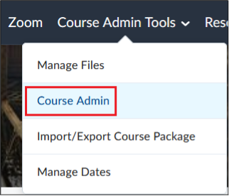
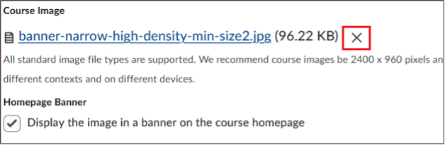

# Change the course banner image

## Step-by-step instructions

1. Select `Course Admin Tools` – `Course Admin`.  

2. Select `Course Offering Information`.  

3. Click on `X` to remove any existing image and click on `Browse` to upload a new image.  

4. Click the `Save` button.

## Video

https://www.youtube.com/watch?v=2kSl0xkq2lM

[Insert H5P in Brightspace](https://georgebrowncollege.h5p.com/content/1291904269107928248)

Video embedded with the [Markdown video too](https://markdown-videos.jorgenkh.no/).

43.67276361029083, -79.39557736747406