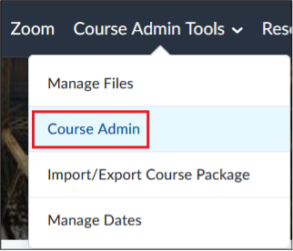

# Course Admin Tools

## Change course start dates and course end dates

1. From the `Course Admin Tools` menu, click on `Course Admin`  

2. Click on `Course Offering Information`  

3. Add new `Start Date` and `End Date`  

### Availability date defaults
These defaults determine the visibility of the assignments and discussion forum activity before the start date and after the activity end date.  You can customize these activities button response as follows:

Before start dates:

- Visible with access restricted before start.
- Visible with submission restricted before start.
- Hidden before start.

After end dates:

- Visible with access restricted after end.
- Visible with submission restricted after end.
- Hidden after end. 

Click Save button after you have finalized the configurations.

Students are allowed to see the Assignment or the Discussion, but they cannot access description or submit their work. It just displays the title of the Assignment or Discussion and the Start and/or End Date.

Visible with restricted submission before start/end dates: Students can access to the description of the Assignment and Discussion, but they are unable to submit their work or participate in the discussion.
Before or after the start or end: the Assignment or Discussion is hidden from the learner.

## Grade Center

### How to Reset a Student's Quiz Attempt

If a student is reporting an issue with their quiz, and you would like to reset their attempt:

For more information, please go to the [TLX website](https://www.georgebrown.ca/teaching-and-learning-exchange).